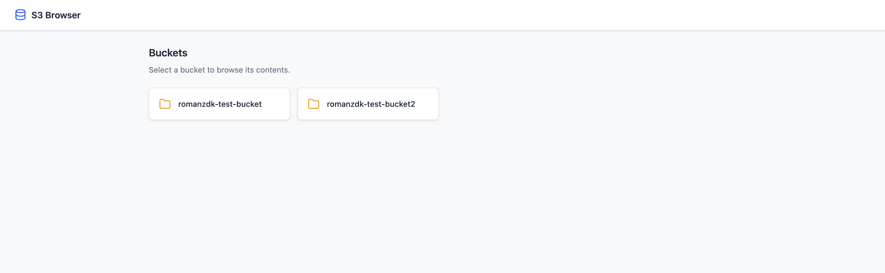
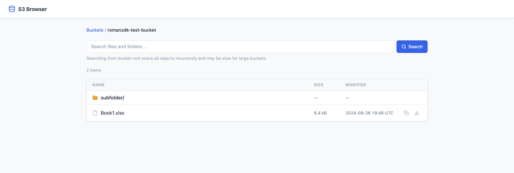
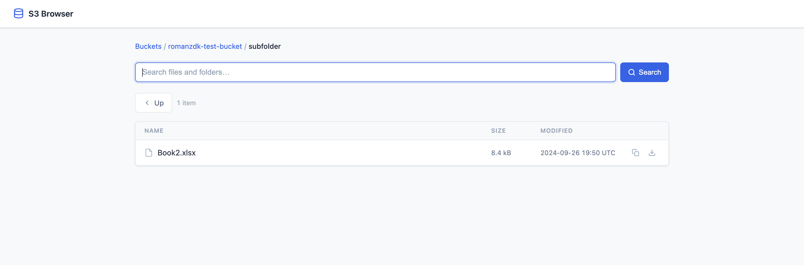

# S3 Web Browser

[](https://python.org)

[](https://github.com/romanzdk/s3-web-browser/stargazers)


S3 Web Browser is a Flask-based web application that allows users to browse AWS S3 buckets and their contents via a simple web interface. It leverages Boto3, AWS's SDK for Python, to interact with S3.







## Features

- **List S3 Buckets**: View all S3 buckets available to the AWS account in a card-based grid layout.
- **Browse Bucket Contents**: Navigate through folders and files with breadcrumb navigation.
- **Search Bucket Contents**: Recursively search for files and folders within any bucket or subdirectory (case-insensitive).
- **Generate Presigned URLs**: Securely download S3 objects via temporary 1-hour presigned URLs.
- **Pagination**: Browse large buckets efficiently with configurable page sizes.
- **Copy S3 Paths**: One-click copy of S3 paths (`s3://bucket/key`) to clipboard.
- **Responsive UI**: Modern interface with loading indicators and smooth navigation.

## Configuration

All configuration is done via environment variables (or a `.env` file):

| Variable | Default | Description |
|---|---|---|
| `AWS_ACCESS_KEY_ID` | — | AWS IAM access key |
| `AWS_SECRET_ACCESS_KEY` | — | AWS IAM secret access key |
| `AWS_DEFAULT_REGION` | `eu-central-1` | AWS region |
| `AWS_ENDPOINT_URL` | — | Custom S3 endpoint (e.g. MinIO, LocalStack) |
| `SECRET_KEY` | `your_default_secret_key` | Flask session secret key |
| `DEBUG` | `False` | Flask debug mode |
| `PAGE_ITEMS` | `300` | Items per page |

See `.env.example` for a template.

## Run

### Docker (pre-built image)

```bash
docker run -it --rm -p 8000:8000 --env-file .env romanzdk/s3-web-browser
```

### Docker (build locally)

1. Create a `.env` file with your AWS credentials (see `.env.example`).
1. `docker build -t s3-browser .`
1. `docker run -it --rm -p 8000:8000 --network=host --env-file .env s3-browser`
1. Open http://127.0.0.1:8000/

## Development

1. Install dependencies: `poetry install`
1. Export AWS credentials:
   ```bash
   export AWS_ACCESS_KEY_ID="your_access_key_id"
   export AWS_SECRET_ACCESS_KEY="your_secret_access_key"
   ```
1. Run code quality checks: `make cq`
1. Run tests: `make test`
1. Start the app: `poetry run python run.py`
1. Open http://127.0.0.1:8000/

### Makefile targets

| Target | Description |
|---|---|
| `make install` | Install dependencies via Poetry |
| `make cq` | Run linter and formatter (Ruff) |
| `make test` | Run tests |
| `make all` | Install, lint, and test |
| `make clean` | Remove temporary files |
| `make release VERSION=x.y.z` | Build and push Docker images |

## License

This project is licensed under the MIT License - see the LICENSE file for details.

## Acknowledgements

- Flask for providing the web framework.
- AWS Boto3 for interfacing with Amazon S3.
