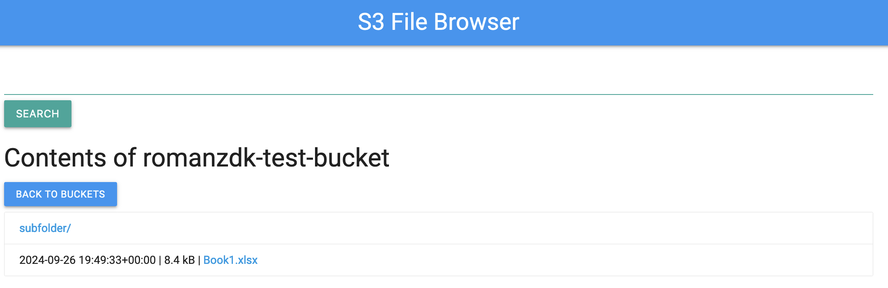
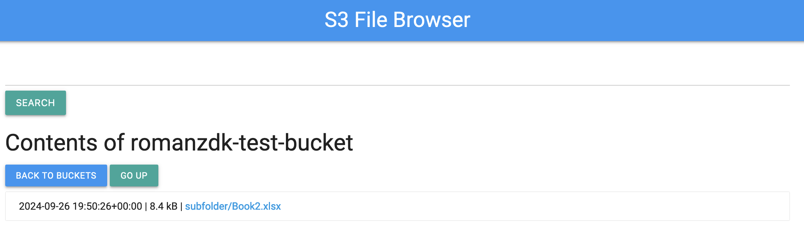

# S3 Web Browser

[](https://python.org)

[](https://github.com/romanzdk/s3-web-browser/stargazers)


S3 Web Browser is a Flask-based web application that allows users to browse AWS S3 buckets and their contents via a simple web interface. This project leverages Boto3, AWS's SDK for Python, to interact with S3.






## Features

- **List S3 Buckets**: View all S3 buckets available to the AWS account.
- **Browse Bucket Contents**: Navigate through the contents of any S3 bucket, including folders and files.
- **Search Bucket Contents**: Search for files/folders in any S3 bucket, The search will be recursive from the point of origin.
- **Generate Presigned URLs**: Securely generate temporary URLs for S3 objects, making them accessible for a limited time.

## Run

### In Docker

1. Specify AWS credentials (`AWS_ACCESS_KEY_ID, AWS_SECRET_ACCESS_KEY`) in `.env` file (example with file `.env.example`). 
   Note that you can specify specific region and endpoint with `AWS_DEFAULT_REGION` and `AWS_ENDPOINT_URL`.
1. `docker build -t s3-browser .`
1. `docker run -it --rm -p 8000:8000 --network=host --env-file .env s3-browser`
1. Go to http://127.0.0.1:8000/ to browse through your files

## Development

1. Setup - `poetry install`
1. Run CQ - `make cq`
1. Run tests - `make test`
1. Export AWS credentials as environment variables

   ```bash
   export AWS_ACCESS_KEY_ID="your_access_key_id"
   export AWS_SECRET_ACCESS_KEY="your_secret_access_key"
   ```

1. Run app - `poetry run gunicorn app:app`
1. Access the app at http://127.0.0.1:8000/

## License

This project is licensed under the MIT License - see the LICENSE file for details.

## Acknowledgements

- Flask for providing the web framework.
- AWS Boto3 for interfacing with Amazon S3.
